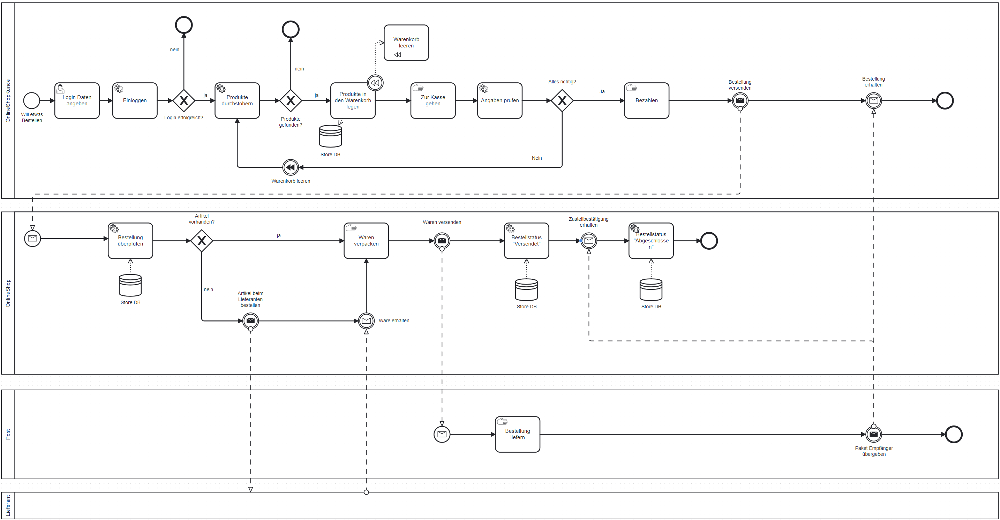
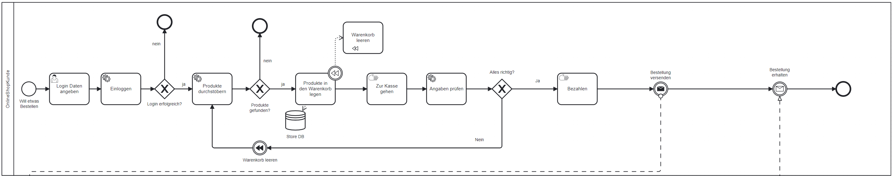
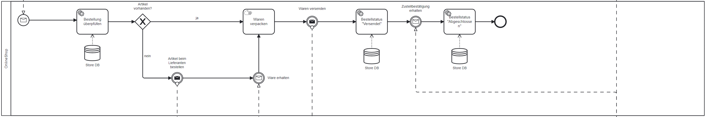
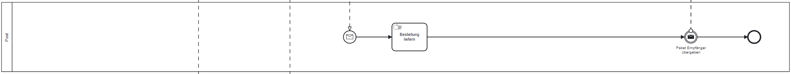

# Geschäftsprozessmodell eines Onlineshops

**Authors**: Ronny Bruhin, Batuhan Seker

**Date**: 20.06.2025

## 1.  Einleitung

Dieses Dokument beschreibt das Geschäftsprozessmodell eines Onlineshops. Das Modell bildet den Kernprozess einer Online-Bestellung ab, von der Kundeninteraktion bis zur Zahlungsabwicklung. Die Erstellung dieses Modells erfolgte im Rahmen des Moduls "254 - Geschäftsprozesse modellieren" an der TBZ.

### 1.1 Ziel und Nutzen

Ziel dieses Prozesses ist es, die Onlinebestellung effizient, kundenfreundlich und automatisiert abzuwickeln. Der Nutzen besteht in:

- Reduktion von Bearbeitungszeiten
- Klarer Trennung von Verantwortlichkeiten
- Transparenz für Kunden und Betreiber
- Grundlage für Prozessautomatisierung und -optimierung sowie KPI-Überwachung (Key Performance Indicators)

## 2.  Beschreibung des Geschäftsprozesses

Der abgebildete Geschäftsprozess beschreibt den Ablauf einer Bestellung in einem Onlineshop und involviert mehrere Akteure: den **Kunden**, den **Shopbetreiber**, den **Lieferanten** und die **Post**.


_Abbildung 1: Geschäftsprozessmodell eines Onlineshops_

### **Kunden-Prozess (Pool "Kunde")**


_Abbildung 2: Pool "Kunde"_

1. **Start:** Der Prozess beginnt im Pool "Kunde" mit dem Start Ereignis **"Will etwas bestellen"**.

2. **Login-Daten eingeben:** Der Kunde gibt seine  Login-Daten ein.

3. **Login:** Das System versucht den Kunden einzuloggen.
    - **Entscheidung:** Ist der Login erfolgreich?
        - **Ja:** Weiter zu **"Adresse eingeben"**.
        - **Nein:** Wenn der Login fehlschlägt, endet der Prozess ohne Bestellung.

4. **Produkte durchstöbern:** Der Kunde stöbert durch die verfügbaren Produkte.
    - **Entscheidung:** Hat der Kunde passende Produkte gefunden?
        - **Ja:** Weiter zu **"Produkte in den Warenkorb legen"**.
        - **Nein:** Wenn der Kunde keine Produkte ausgewählt hat, endet der Prozess ohne Bestellung.

5. **Produkte in den Warenkorb legen:** Der Kunde legt die ausgewählten Produkte in den Warenkorb.
Dabei wird ein **Kompensations-Ereignis** ausgelöst, um den Warenkorb bei Bedarf zurückzusetzen.
Der Warenkorb wird in der Datenbank gespeichert.

6. **Zur Kasse gehen (manuell):**

7. **Angaben prüfen:** Der Kunde prüft die Angaben im Warenkorb und seine eigenen Angaben(Bezahlart, Lieferadresse, usw.).

8. **Alles richtig?**
    - **Entscheidung:** Sind alle Angaben korrekt?
        - **Ja:** Weiter zu **"Bestellung abschicken"**.
        - **Nein:** Die Compensation wird ausgelöst, welche den Warenkorb leert.

9. **Zahlungsdaten eingeben:** Der Kunde wählt die Zahlungsmethode aus und gibt die erforderlichen Zahlungsinformationen ein.

10. **Bestellung abschicken:** Der Kunde schickt die Bestellung ab, was eine Nachricht an den Geschäftskunden auslöst.

11. **Bestellung erhalten:** Der Kunde erhält sein Paket.

12. **Ende:** Der Prozess endet mit dem Empfang der Bestellung.

### **OnlineShop-Prozess (Pool OnlineShop")**


_Abbildung 3: Pool "OnlineShop"_

1. **Start:** Der Prozess beginnt mit dem Empfang der **"Bestellung erhalten"-Nachricht** vom Kunden.

2. **Bestellung überprüfen:** Der Shop prüft die Bestellung auf Gültigkeit.
    - **Entscheidung:** Ist der Artikel vorhanden?
        - **Ja:** Weiter zu **"Waren verpacken"**.
        - **Nein:** Weiter zu **"Artikel beim Lieferanten bestellen"**.

3. **Artikel beim Lieferanten bestellen:** Der Shop bestellt den Artikel beim Lieferanten.

4. **Waren erhalten:** Der Shop erhält die Waren vom Lieferanten.

5. **Waren verpacken:** Der Shop verpackt die Waren für den Versand.

6. **Waren versenden:** Der Shop sendet die Waren an die Post, was eine **"Warensendung"-Nachricht** auslöst.

7. **Bestellstatus "Versendet":** Der Shop aktualisiert den Bestellstatus auf "Versendet". Dies wird in der Datenbank gespeichert.

8. **Zustellbestätigung erhalten:** Der Shop erhält eine **"Wareneingang"-Nachricht** von der Post, die den erfolgreichen Versand bestätigt.

9. **Bestellstatus "Abgeschlossen":** Der Shop aktualisiert den Bestellstatus auf "Abgeschlossen". Dies wird in der Datenbank gespeichert.

10. **Ende:** Der Prozess endet mit der Aktualisierung des Bestellstatus.

### **Post-Prozess (Pool "Post")**


_Abbildung 4: Pool "Post"_

1. **Start:** Der Prozess beginnt mit dem Empfang der **"Warensendung"-Nachricht** vom Geschäftskunden.

2. **Bestellung liefern:** Die Post liefert die Bestellung an den Kunden.

3. **Paket an Kunden übergeben:** Die Post übergibt das Paket an den Kunden.

4. **Ende:** Der Prozess endet mit der Übergabe des Pakets an den Kunden.

### **Lieferanten-Prozess (Pool "Lieferant")**

Der Lieferantenprozess ist im Modell als Platzhalter enthalten, da die interne Logik nicht Teil des betrachteten Systems ist.

## 3. Architektur

### 3.1 Setup

Install packages with:

```bash
pip install -r requirements.txt
```

Cd into app directory and start the application with:

```bash
uvicorn main:get_app --reload --factory

```
